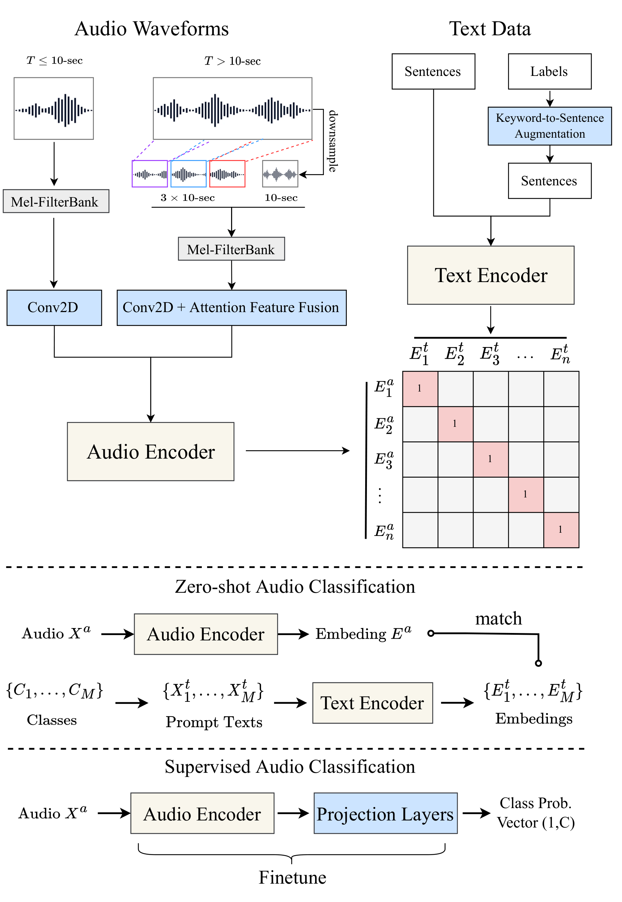

# CLAP

Contrastive Language-Audio Pretraining, known as CLAP. Referring to the CLIP (Contrastive Language-Image Pretraining) architecture, similarly, the CLAP architecture is as follows.  
<p align="center">
  
</p>


The repository contains code for the following paper:
 - [Large-scale Contrastive Language-Audio Pretraining with Feature Fusion and Keyword-to-Caption Augmentation](https://arxiv.org/abs/2211.06687)

## About this project

This project is a project in [LAION](https://laion.ai/) that aims at learning better audio understanding and getting more audio data. 
This is an opensource project. We adopt the codebase of [open_clip](https://github.com/mlfoundations/open_clip) for this project. 
The major opensource contributers of this project are (in equal contribution): Yusong Wu, Tianyu Zhang, Ke Chen.

many thanks to <a href="https://github.com/cfoster0/CLAP">@cfoster0</a> for allowing us to use his repo name.

## Environment Installation
To install the same environment as we use, please run the following command:
```bash
conda create env -n clap python=3.10
conda activate clap
git clone https://github.com/LAION-AI/CLAP.git
cd CLAP
# you can also install pytorch by following the official instruction (https://pytorch.org/get-started/locally/)
pip install torch==1.11.0+cu113 torchvision==0.12.0+cu113 torchaudio==0.11.0+cu113 -f https://download.pytorch.org/whl/torch_stable.html
pip install -r requirements.txt
```
## Dataset format
We use training data in webdataset format. For details of our dataset please see https://github.com/LAION-AI/audio-dataset.

You can find an example of our dataset format in [here](https://drive.google.com/drive/folders/1aU54FGctrjhxA2sTN0wgHVsPm0nPEc_E?usp=share_link).
It contains the full ESC50 dataset, split according to the first 5-fold split.

## Training, Fine-tuning and Evaluation
Please find the script of training, fine-tuning and evaluation (zero-shot and retrieval) in the [experiment_scripts](./experiment_scripts) folder. 
The scripts included there are the one we used to train our model on a SLURM cluster. 
You need to change the script to fit your own environment.
For example, in a single machine multi-GPU setting, you might want to use `torchrun` instead of `srun` to run the script.
To train on a single GPU machine, use `CUDA_VISIBLE_DEVICES=0 python -m ...` instead of `srun`.
We use [Weights and Biases](https://wandb.ai/site) for experiment logging. You need to configure the weights and biases in your environment.

## Loading Model and Inference
Please refer to [infer_demo.py](src/training/infer_demo.py) to get the whole view of using our model to infer the audio and text embeddings.
Below is the core code.
```python
# import necessary libraries
def infer_audio():
    
    '''
    set hyperparameters, and load pretrain model
    '''
    
    # load the waveform of the shape (T,), should resample to 48000
    audio_waveform, sr = librosa.load('/home/la/kechen/Research/KE_CLAP/ckpt/test_clap_long.wav', sr=48000) 
    # quantize
    audio_waveform = int16_to_float32(float32_to_int16(audio_waveform))
    audio_waveform = torch.from_numpy(audio_waveform).float()
    audio_dict = {}

    # the 'fusion' truncate mode can be changed to 'rand_trunc' if run in unfusion mode
    audio_dict = get_audio_features(
        audio_dict, audio_waveform, 480000, 
        data_truncating='fusion', 
        data_filling='repeatpad',
        audio_cfg=model_cfg['audio_cfg']
    )
    # can send a list to the model, to process many audio tracks in one time (i.e. batch size)
    audio_embed = model.get_audio_embedding([audio_dict])
    print(audio_embed.size())

def infer_text():
    '''
    set hyperparameters, and load pretrain model
    '''
    
    # load the text, can be a list (i.e. batch size)
    text_data = ["I love the contrastive learning", "I love the pretrain model"] 
    # tokenize for roberta, if you want to tokenize for another text encoder, please refer to data.py#L43-90 
    text_data = tokenizer(text_data)
    
    text_embed = model.get_text_embedding(text_data)
    print(text_embed.size())
    
```

## Pretrained Models
The pretrained checkpoints can be found in [here](https://drive.google.com/drive/folders/1Ni8lZ2pryTESjgq8gELLQNM_HGdWtFrE?usp=sharing).
Please refer to the previous section for how to load and run the checkpoints.

The checkpoints list here for each model setting is the one with the highest average mAP score in training.
The average mAP score is calculated by averaging 4 scores: A-->T mAP@10 on AudioCaps, and T-->A mAP@10 on AudioCaps, A-->T mAP@10 on Clotho, and T-->A mAP@10 on Clotho.

## Reproducibility
An example of the preprocessed Clotho dataset in webdataset format can be download [here](). The audio encoder pretrained with 48kHz AudioSet can be found [here](https://drive.google.com/drive/folders/1SMQyzJvc6DwJNuhQ_WI8tlCFL5HG2vk6?usp=sharing), where `HTSAT-fullset-imagenet-map=0.467.ckpt` is the checkpoint used to initalize our HTSAT audio encoder. You should get similar result by loading from the audio encoder checkpoint and training on same dataset.
Because most of the dataset has copyright restriction, unfortunatly we cannot directly share other preprocessed datasets. 


## Citation
If you find this project and the LAION-Audio-630K dataset useful, please cite our paper:
```
@article{wu2022large,
  title = {Large-scale Contrastive Language-Audio Pretraining with Feature Fusion and Keyword-to-Caption Augmentation},
  author = {Wu, Yusong and Chen, Ke and Zhang, Tianyu and Hui, Yuchen and Berg-Kirkpatrick, Taylor and Dubnov, Shlomo},
  journal={arXiv preprint arXiv:2211:06687},
  year = {2022},
}
```

## Acknowledgements

This project is working in progress, thus the codebase and model might not be perfect or bug-free. 
We will very much appreciate any kind of contribution or and issue raised.
If you find a bug or have any suggestion, please feel free to open an issue or contact us.
If you would actively contribute to this project, please join the discord of LAION.
